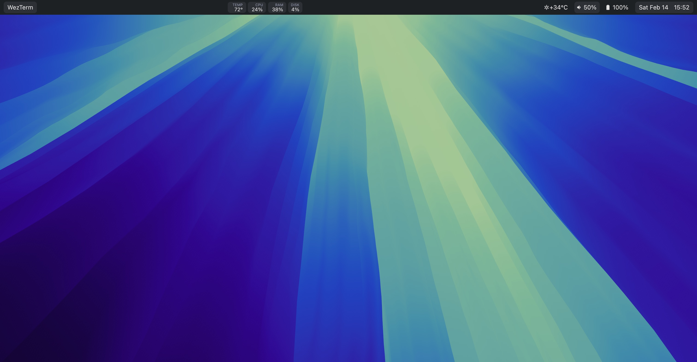

<p align="center">
  
</p>

<h1 align="center">Sinew</h1>

<p align="center">
  <a href="https://github.com/dungle-scrubs/sinew/actions/workflows/ci.yml"></a>
  <a href="https://opensource.org/licenses/MIT"></a>
</p>

A macOS menu bar replacement built in Rust. Features notch-aware split layouts, modular widgets, and hot-reload configuration.

<p align="center">
  
</p>

## Features

- **Notch-aware layout** - Automatically splits around MacBook notch, or use fake notch on external displays
- **Four-zone module placement** - Left outer, left inner, right inner, right outer
- **Hot-reload configuration** - Edit config and see changes instantly
- **Built-in modules** - Clock, date, battery, volume, CPU, memory, weather, app name, and more
- **Popups and panels** - Calendar popups, script-driven content panels
- **Toggle groups** - Radio-button style module groups with active state styling
- **Autohide support** - Slides down when macOS menu bar appears

## Requirements

- macOS 12.0 (Monterey) or later
- Rust 1.75+

## Installation

### Homebrew (recommended)

```bash
brew install dungle-scrubs/sinew/sinew
```

### Run at Login

```bash
brew services start sinew
```

### Building from Source

```bash
git clone https://github.com/dungle-scrubs/sinew.git
cd sinew
cargo build --release
cp target/release/sinew /usr/local/bin/
```

## Usage

```bash
# Run with default config (~/.config/sinew/config.toml)
sinew

# Run with debug logging
RUST_LOG=debug sinew
```

### IPC Commands

```bash
# Force redraw
cargo run --bin sinew-msg -- redraw

# Reload configuration
cargo run --bin sinew-msg -- reload

# Get status
cargo run --bin sinew-msg -- status
```

## Configuration

Create `~/.config/sinew/config.toml`:

```toml
[bar]
background_color = "#1D2123"
text_color = "#e2e2e2"
font_size = 13.0
font_family = "JetBrainsMono Nerd Font"
padding = 4.0
border_color = "#5f656a"
border_width = 1.0
border_radius = 6.0
autohide = true  # Slide down when macOS menu bar appears

# Left side modules
[[modules.left.left]]
type = "app_name"
max_length = 30
background = "#2C3135"
padding = 8.0
corner_radius = 6.0

# Right side modules (left to right order)
[[modules.right.right]]
type = "weather"
location = "auto"
update_interval = 600
color = "#50cae5"

[[modules.right.right]]
type = "battery"
color = "#8ec475"
warning_color = "#dcc37c"
warning_threshold = 30
critical_color = "#e8626f"
critical_threshold = 15

[[modules.right.right]]
type = "clock"
format = "%H:%M"
background = "#2C3135"
padding = 8.0
corner_radius = 6.0
```

See [config.example.toml](config.example.toml) for all options.

### Module Types

| Type | Description |
|------|-------------|
| `clock` | Time display with custom format |
| `date` | Date display with optional calendar popup |
| `datetime` | Combined date and time |
| `battery` | Battery percentage with threshold colors |
| `cpu` | CPU usage percentage (Mach API) |
| `memory` | Memory usage |
| `disk` | Disk usage for a given path |
| `temperature` | CPU temperature via smctemp |
| `volume` | System volume level |
| `wifi` | WiFi connection status |
| `app_name` | Active application name (NSWorkspace) |
| `window_title` | Active window title |
| `now_playing` | Currently playing media |
| `weather` | Weather from wttr.in |
| `script` | Custom script output |
| `static` | Static text with optional icon |
| `separator` | Space, line, dot, or icon separator |

## Known Limitations

- **macOS only** - Uses AppKit/Core Graphics directly
- **Weather uses wttr.in** - No API key required, but rate limits apply
- **No multi-monitor support yet** - Shows on primary display only

## Contributing

See [CONTRIBUTING.md](CONTRIBUTING.md) for guidelines.

## License

[MIT](LICENSE)
